<!-- Vygenerovaný soubor – upravuj templates/README.cs.md. -->

🌐 <a href="https://github.com/Ypsilonx">English</a> · <b>Čeština</b>

<picture><source media="(prefers-color-scheme: dark)" srcset="assets/header.cs.dark.svg"></picture>

## 🚀 O mně

- 🐍 **Python vývojář** z Valašska – samouk a jsem na to hrdý.
- 🔌 Tvořím **desktopové aplikace** (Tkinter, PyQt), hraji si s **embedded zařízeními** (ESP32, Raspberry Pi Pico) a propojuji Python se softwarem třetích stran.
- 🏢 V práci se potkávám i s **C#** a **VBScriptem** kvůli licencovaným softwarům.
- 🎯 **Aktuálně:** velký pracovní projekt a učení **Rustu**.
- 🎓 Učil jsem se s Czechitas, Codewars, Checkio, SoloLearn a komunitou Junior.Guru.

## 🛠️ Technologie

<picture><source media="(prefers-color-scheme: dark)" srcset="assets/tech.cs.dark.svg"></picture>

## ⭐ Vybrané projekty

- **[Rally-safety-organization-app](https://github.com/Ypsilonx/Rally-safety-organization-app)** – komisař a vedení RZ: komunikace a bezpečnost v jedné aplikaci.
- **[ThermoControl_LG_POER_app](https://github.com/Ypsilonx/ThermoControl_LG_POER_app)** – vlastní aplikace na ovládání klimatizace LG.

## 🔥 Naposledy aktivní

| Projekt | Jazyk | Aktivita (12 týd.) | Commity (12 týd.) | Poslední push |
|:--|:--|:--:|--:|:--|
| **[factorio\_loader-unloader](https://github.com/Ypsilonx/factorio_loader-unloader)** — | 🌙 Lua | <picture><source media="(prefers-color-scheme: dark)" srcset="assets/spark/factorio_loader-unloader.dark.svg"></picture> | 37 | 8. 10. 2026 🟢 aktivní |
| **[factorio\_bi\_pump](https://github.com/Ypsilonx/factorio_bi_pump)** — | 🌙 Lua | <picture><source media="(prefers-color-scheme: dark)" srcset="assets/spark/factorio_bi_pump.dark.svg"></picture> | 20 | 8. 10. 2026 🟢 aktivní |
| **[factorio\_Strata\_Industry](https://github.com/Ypsilonx/factorio_Strata_Industry)** — | 🌙 Lua | <picture><source media="(prefers-color-scheme: dark)" srcset="assets/spark/factorio_Strata_Industry.dark.svg"></picture> | 74 | 7. 10. 2026 🟢 aktivní |
| **[ThermoControl\_LG\_POER\_app](https://github.com/Ypsilonx/ThermoControl_LG_POER_app)** vlastní aplikace na ovládání LG klimatizace | 🐍 Python | <picture><source media="(prefers-color-scheme: dark)" srcset="assets/spark/ThermoControl_LG_POER_app.dark.svg"></picture> | 34 | 1. 10. 2026 🟢 aktivní |
| **[widget\_windows\_10](https://github.com/Ypsilonx/widget_windows_10)** — | 🐍 Python | <picture><source media="(prefers-color-scheme: dark)" srcset="assets/spark/widget_windows_10.dark.svg"></picture> | 4 | 27. 9. 2026 🟢 aktivní |
| **[Rally-safety-organization-app](https://github.com/Ypsilonx/Rally-safety-organization-app)** Komisař, Vedení RZ - komunikace a bezpečnost v jednom. | 🐍 Python | <picture><source media="(prefers-color-scheme: dark)" srcset="assets/spark/Rally-safety-organization-app.dark.svg"></picture> | 53 | 5. 9. 2026 |

## 📊 GitHub statistiky

<picture><source media="(prefers-color-scheme: dark)" srcset="assets/stats.cs.dark.svg"></picture>
<picture><source media="(prefers-color-scheme: dark)" srcset="assets/languages.cs.dark.svg"></picture>
<picture><source media="(prefers-color-scheme: dark)" srcset="assets/activity.cs.dark.svg"></picture>

<b>💡 Zajímavosti</b>

- 🏔️ **Z Valašska:** technologie sem dorazí o deset let později, ale máme čistý vzduch!
- 🤖 **Moji senior kolegové:** AI asistenti (Claude, GitHub Copilot) a Stack Overflow.
- ☕ **Palivo:** kofein a dobrá hudba (DnB).
- 🎯 **Motto:** „Když to nejde, zkus to znovu. Když to pořád nejde, zkus jiný přístup!“
- 🎮 **Mimo klávesnici:** hry, horské túry a podpora Ukrajiny 🇺🇦.

## 🤝 Pojďme se spojit

<a href="https://www.linkedin.com/in/ypsilonxpython/"><picture><source media="(prefers-color-scheme: dark)" srcset="assets/contact-linkedin.dark.svg"></picture></a>
<a href="https://discord.com/users/311947085278740480"><picture><source media="(prefers-color-scheme: dark)" srcset="assets/contact-discord.dark.svg"></picture></a>

<picture><source media="(prefers-color-scheme: dark)" srcset="assets/divider.dark.svg"></picture>

<i>„Kód je poezie, kterou píšeme pro stroje, ale čtou ji lidé.“</i>

