<!-- Generated file – edit templates/README.en.md instead. -->

🌐 <b>English</b> · <a href="https://github.com/Ypsilonx/Ypsilonx/blob/main/README.cs.md">Čeština</a>

<picture><source media="(prefers-color-scheme: dark)" srcset="assets/header.en.dark.svg"></picture>

## 🚀 About me

- 🐍 **Python developer** from Wallachia, Czech Republic – self-taught and proud of it.
- 🔌 I build **desktop apps** (Tkinter, PyQt), tinker with **embedded devices** (ESP32, Raspberry Pi Pico) and connect Python with third-party software.
- 🏢 At work I also deal with **C#** and **VBScript** for licensed software.
- 🎯 **Right now:** a large work project and learning **Rust**.
- 🎓 Learned with Czechitas, Codewars, Checkio, SoloLearn and the Junior.Guru community.

## 🛠️ Tech stack

<picture><source media="(prefers-color-scheme: dark)" srcset="assets/tech.en.dark.svg"></picture>

## ⭐ Featured projects

- **[Rally-safety-organization-app](https://github.com/Ypsilonx/Rally-safety-organization-app)** – stage commissioner and stage management: communication and safety in one app.
- **[ThermoControl_LG_POER_app](https://github.com/Ypsilonx/ThermoControl_LG_POER_app)** – my own app for controlling an LG air conditioner.

## 🔥 Recently active

| Project | Language | Activity (12 wk) | Commits (12 wk) | Last push |
|:--|:--|:--:|--:|:--|
| **[mod\_factorio\_python](https://github.com/Ypsilonx/mod_factorio_python)** — | 🌙 Lua | <picture><source media="(prefers-color-scheme: dark)" srcset="assets/spark/mod_factorio_python.dark.svg"></picture> | 47 | Oct 9, 2026 🟢 active |
| **[factorio\_loader-unloader](https://github.com/Ypsilonx/factorio_loader-unloader)** — | 🌙 Lua | <picture><source media="(prefers-color-scheme: dark)" srcset="assets/spark/factorio_loader-unloader.dark.svg"></picture> | 37 | Oct 8, 2026 🟢 active |
| **[factorio\_bi\_pump](https://github.com/Ypsilonx/factorio_bi_pump)** — | 🌙 Lua | <picture><source media="(prefers-color-scheme: dark)" srcset="assets/spark/factorio_bi_pump.dark.svg"></picture> | 20 | Oct 8, 2026 🟢 active |
| **[factorio\_Strata\_Industry](https://github.com/Ypsilonx/factorio_Strata_Industry)** — | 🌙 Lua | <picture><source media="(prefers-color-scheme: dark)" srcset="assets/spark/factorio_Strata_Industry.dark.svg"></picture> | 74 | Oct 7, 2026 🟢 active |
| **[ThermoControl\_LG\_POER\_app](https://github.com/Ypsilonx/ThermoControl_LG_POER_app)** vlastní aplikace na ovládání LG klimatizace | 🐍 Python | <picture><source media="(prefers-color-scheme: dark)" srcset="assets/spark/ThermoControl_LG_POER_app.dark.svg"></picture> | 34 | Oct 1, 2026 🟢 active |
| **[widget\_windows\_10](https://github.com/Ypsilonx/widget_windows_10)** — | 🐍 Python | <picture><source media="(prefers-color-scheme: dark)" srcset="assets/spark/widget_windows_10.dark.svg"></picture> | 4 | Sep 27, 2026 🟢 active |

## 📊 GitHub stats

<picture><source media="(prefers-color-scheme: dark)" srcset="assets/stats.en.dark.svg"></picture>
<picture><source media="(prefers-color-scheme: dark)" srcset="assets/languages.en.dark.svg"></picture>
<picture><source media="(prefers-color-scheme: dark)" srcset="assets/activity.en.dark.svg"></picture>

<b>💡 Fun facts</b>

- 🏔️ **From Wallachia:** technology arrives ten years late, but the air is clean!
- 🤖 **My senior colleagues:** AI assistants (Claude, GitHub Copilot) and Stack Overflow.
- ☕ **Fuel:** caffeine and good music (DnB).
- 🎯 **Motto:** “If it doesn't work, try again. If it still doesn't work, try a different approach!”
- 🎮 **Off the keyboard:** gaming, mountain hikes and supporting Ukraine 🇺🇦.

## 🤝 Let's connect

<a href="https://www.linkedin.com/in/ypsilonxpython/"><picture><source media="(prefers-color-scheme: dark)" srcset="assets/contact-linkedin.dark.svg"></picture></a>
<a href="https://discord.com/users/311947085278740480"><picture><source media="(prefers-color-scheme: dark)" srcset="assets/contact-discord.dark.svg"></picture></a>

## ☕ Support my work

If my projects saved you some time or you simply like them, you can buy me a coffee. Thank you! 🙏

<a href="https://buymeacoffee.com/ypsilonx"><picture><source media="(prefers-color-scheme: dark)" srcset="assets/support-buymeacoffee.dark.svg"></picture></a>

<picture><source media="(prefers-color-scheme: dark)" srcset="assets/divider.dark.svg"></picture>

<i>“Code is poetry we write for machines, but people read it.”</i>

